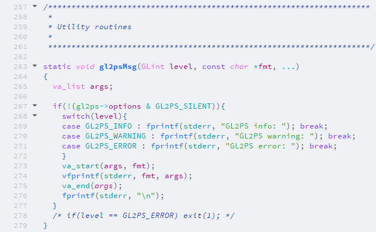

# qtcreator-color-scheme
A custom made color scheme for Qt Creator

## Yae Miko (based on Dracula)
Dark color scheme with *mostly* dark purple and pink pastel colors

## Furina
Light theme with purple, pink and blue aesthetics just like the Archon Furina

## How to import:
1. download .xml file and save to \
*For Windows:* .../*path_to_your_Qt_install*/Tools/QtCreator/share/qtcreator/styles
